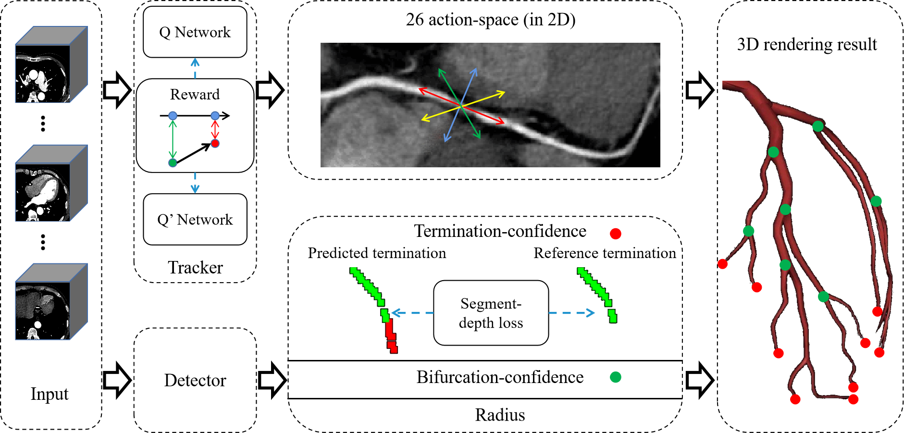
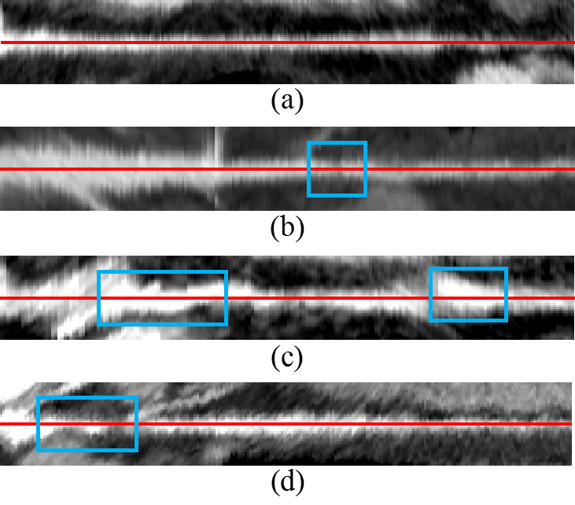
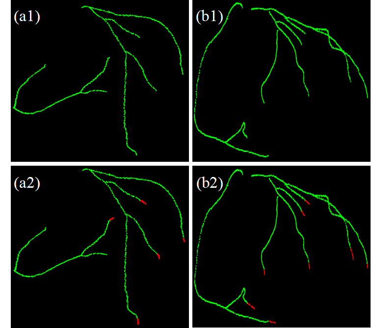

# BEACCE

Code for our paper "[BEACCE: Branch-Endpoint-Aware Double-DQN for Coronary Centerline Extraction in CT Angiography Images](https://link.springer.com/chapter/10.1007/978-3-030-59725-2_4)". 

- Propose the Double Deep Q-network based coronary artery tracing method in CCTA for the first time.
- Extracts the entire coronary tree with lower time-cost than other state-of-the-art methods, uses only one seed and terminates tracing automatically.

The pipeline of our method is shown below:

<p align="center">
     


## Requirements

Python 3.6.2

Pytorch 1.7

CUDA 11.2

## Coordinate transformation

```
python w_coor2v_coor.py
```
    
## Training

```
python ddqn.py
python detector.py

```

## Inference

```
python app.py
```
    
## Results

Multi-planar reconstructions using successfully extracted centerlines (in red) of arteries with (a) no plaque (RCA in data00), (b) a soft plaque (LAD in data01), (c) a calcified plaque (RCA in data08) and (d) a mixed plaque (LAD in data17). All plaques are indicated by blue boxes.

<p align="center">
    
</p>

(a1)(b1) Extraction results by termination criterion without segment-depth weighting strategy. (a2)(b2) Extraction results by termination criterion with segment-depth weighting strategy. Each centerline in (a2)(b2) has a extra part (in red) than that in (a1)(b1). Centerline trees extracted using the termination criterion based on segment-depth weighting strategy were more complete.

<p align="center">
     
</p>

## Cite

Please consider citing this project in your publications if it helps your research. The following is a BibTeX reference. The BibTeX entry requires the url LaTeX package.

    @inproceedings{zhang2020branch,
      title={Branch-aware double DQN for centerline extraction in coronary CT angiography},
      author={Zhang, Yuyang and Luo, Gongning and Wang, Wei and Wang, Kuanquan},
      booktitle={International Conference on Medical Image Computing and Computer-Assisted Intervention},
      pages={35--44},
      year={2020},
      organization={Springer}
      }
